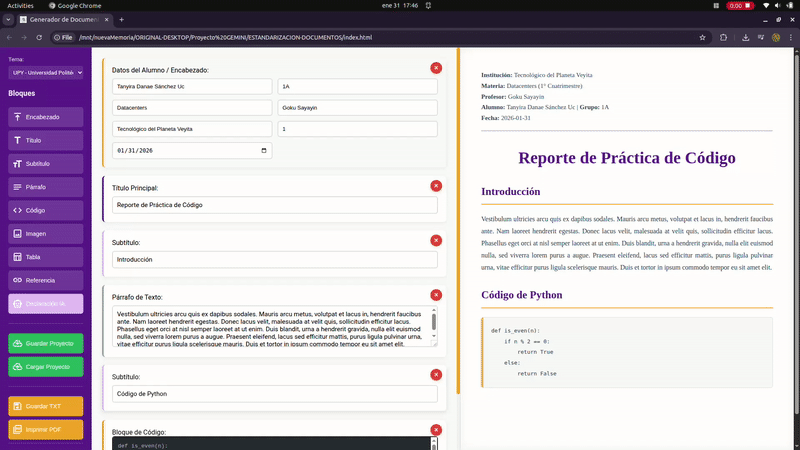

# Generador de Reportes Académicos

> Herramienta web profesional para crear reportes académicos con vista previa en tiempo real


---

## Descripción

Aplicación web 100% cliente para generar documentos académicos profesionales con múltiples tipos de bloques: encabezados, títulos, párrafos, código, imágenes, **tablas**, referencias IEEE y **declaración de uso de IA**.

### Características Principales

- **Guardar y Cargar Proyectos**: Guarda el trabajo en JSON (con encabezado y configuración incluidos) y continúalo después, incluso en otra computadora
- **Google Drive**: Guarda y abre proyectos directamente desde tu Google Drive
- **9 Tipos de Bloques**: Encabezado, Título, Subtítulo, Párrafo, Código, Imagen, Tabla, Referencia, Declaración IA
- **Universidades Configurables**: Incluye UPY, TSW y UPP, y puedes añadir las tuyas con colores y logos propios
- **Panel de Configuración**: Administra universidades, materias y profesores en un solo lugar
- **Materia → Profesor**: Vincula cada materia con su profesor; al elegir la materia, el profesor se llena solo
- **Autoguardado**: Los datos del encabezado se guardan solos mientras escribes
- **Tablas Profesionales**: Grid visual de 1-6 columnas con diseño académico
- **Declaración de IA**: Sistema completo para documentar uso de herramientas de IA
- **Exportación Triple**: PDF (impresión), TXT y JSON (proyecto completo)
- **Seguro**: Protección XSS completa
- **Responsive**: Funciona en desktop, tablet y móvil
- **Sin Backend**: Todo en el navegador, sin servidor

---

## Guardar y Cargar Proyectos

### Funcionalidad de Persistencia:
- **Guardar Proyecto**: Exporta el trabajo completo como archivo JSON
- **Cargar Proyecto**: Restaura proyectos guardados previamente
- **Formato**: JSON con los bloques, el tema, los datos del encabezado y la configuración (universidades, materias, profesores y vínculos materia → profesor)
- **Nombre automático**: `REPORTE-FECHA-YYYY-MM-DD-HORA-HH-MM.json`
- **Otra computadora**: Al cargar un proyecto se añaden las universidades, materias y profesores que falten en ese navegador, sin borrar ni cambiar los que ya existen
- **Compatibilidad**: Los proyectos guardados con versiones anteriores se siguen abriendo sin problema

### Casos de Uso:
- **Trabajo en múltiples sesiones**: Guarda y continúa después
- **Respaldo**: Mantén versiones de tu trabajo
- **Colaboración**: Comparte proyectos con compañeros
- **Recuperación**: No pierdas datos si se cierra el navegador

### Características:
- Validación de archivos JSON
- Confirmación antes de sobrescribir trabajo actual
- Restauración completa de bloques, tema, encabezado y configuración
- Manejo robusto de errores
- Timestamp automático

---

## Google Drive

Además de descargar el archivo JSON, puedes guardar y abrir tus proyectos directamente en Google Drive:

- **Conectar Google Drive**: Inicia sesión con tu cuenta de Google
- **Guardar en Drive**: Guarda el proyecto (te pregunta el nombre del archivo)
- **Abrir desde Drive**: Muestra la lista de proyectos que guardaste desde la app

La app solo tiene acceso a los archivos que ella misma crea en tu Drive (permiso `drive.file`).

> **Importante:** Google Drive solo funciona si la página se sirve por `http://` o `https://` (por ejemplo con GitHub Pages o con la extensión Live Server de VS Code). Abrir `index.html` con doble clic (`file://`) no funciona. Si usas tu propio despliegue, sigue las instrucciones del botón **?** junto a "Google Drive" o los comentarios de `GOOGLE_DRIVE_CLIENT_ID` en `JS/script.js`.

---

## Panel de Configuración

El botón **Configuración** de la barra lateral abre un panel con tres pestañas:

- **Universidades**: añade, edita o elimina universidades (nombre, colores del tema y logos izquierdo y derecho). La universidad "Genérica" no se puede eliminar.
- **Materias**: añade, edita o elimina materias y elige qué profesor imparte cada una.
- **Profesores**: añade, edita o elimina profesores.

Todo lo que cambies aquí se refleja al momento en el bloque de Encabezado.

Los logos se reducen automáticamente a un máximo de 400 px por lado al subirlos, para que no llenen el espacio del navegador; en el documento se siguen viendo nítidos.

---

## Demo en Vivo

**GitHub Pages:** [https://JorgeTSW.github.io/generador-reportes-academicos/](https://JorgeTSW.github.io/generador-reportes-academicos/)

---

## Capturas de Pantalla

### Drag & Drop Feature


### Save & Load Feature



---

## Universidades Incluidas

Además de estas, puedes añadir las tuyas desde **Configuración**. El color de la interfaz sigue a la universidad seleccionada.

### Genérica (sin institución)
- Gris neutro, sin logos
- Para trabajos que no llevan identidad institucional

### TSW - Tecnológico de Software
- Azul Oscuro (#2C2E5C) + Cyan (#00B8E6)
- Estilo moderno y tecnológico

### UPY - Universidad Politécnica de Yucatán
- Morado (#5B1F8C) + Oro (#F5A623)
- Elegante y distintivo

### UPP - Universidad Privada de la Península
- Azul Fuerte (#0047AB) + Rojo (#E31E24)
- Clásico y profesional

---

## Instalación

### Opción 1: Uso Directo (Sin Instalación)

1. Descarga el proyecto:
```bash
git clone https://github.com/JorgeTSW/generador-reportes-academicos.git
```

2. Abre `index.html` en tu navegador

No requiere instalación de dependencias. Para usar Google Drive, sírvela por `http://` (por ejemplo con la extensión Live Server de VS Code).

### Opción 2: GitHub Pages

Simplemente visita: [https://JorgeTSW.github.io/generador-reportes-academicos/](https://JorgeTSW.github.io/generador-reportes-academicos/)

---

## Uso Rápido

### 1. Seleccionar Universidad
Usa el selector en la parte superior de la barra lateral para elegir tu institución.

### 2. Configurar tus Materias y Profesores
Abre **Configuración** y añade tus materias y profesores. Vincula cada materia con su profesor para que se llene solo en el encabezado.

### 3. Agregar Bloques
Click en los botones de la barra lateral:
- **Encabezado** - Datos del estudiante (se guardan solos; el botón "Limpiar" los borra)
- **Título** - Título del reporte
- **Subtítulo** - Secciones
- **Párrafo** - Texto
- **Código** - Snippets de código
- **Imagen** - Imágenes con descripción
- **Tabla** - Tablas de 1-6 columnas
- **Referencia** - Bibliografía IEEE
- **Declaración IA** - Declaración de uso de IA

### 4. Exportar
- **Imprimir PDF** - Ctrl+P
- **Guardar TXT** - Botón "Guardar TXT"
- **Guardar Proyecto** - Botón "Guardar Proyecto" (JSON)
- **Cargar Proyecto** - Botón "Cargar Proyecto" (JSON)
- **Guardar en Drive / Abrir desde Drive** - Sección "Google Drive" de la barra lateral

---

## Sistema de Tablas

### Características:
- **1 a 6 columnas** configurables
- **Grid visual** tipo Excel
- **Agregar/eliminar filas** dinámicamente
- **Numeración automática** (Tabla 1, 2, 3...)
- **Descripción/caption**
- **Word-wrap** en headers y contenido
- **Estilo académico formal**

### Ejemplo:
```
Columnas: 3

┏━━━━━━━━━┳━━━━━━━━━┳━━━━━━━━━┓
┃ Header1 ┃ Header2 ┃ Header3 ┃
┣━━━━━━━━━╋━━━━━━━━━╋━━━━━━━━━┫
┃ Dato1   ┃ Dato2   ┃ Dato3   ┃
┗━━━━━━━━━┻━━━━━━━━━┻━━━━━━━━━┛

Tabla 1: Descripción de la tabla
```

---

## Declaración de IA

Sistema completo para cumplir con políticas de integridad académica.

### Opción "NO usé IA":
- Disclaimer automático
- Usa el nombre del alumno (o de todos los integrantes del equipo) del Encabezado
- Campo de nombre individual para escribir otro nombre si hace falta
- Compromiso documentado

### Opción "SÍ usé IA":
- Nombre del estudiante (por defecto, el del Encabezado)
- IA utilizada (ChatGPT, Claude, Gemini, etc.)
- Fecha de uso
- Propósito
- Prompt completo
- Archivos adjuntos
- Respuesta en crudo (raw)

---

## Estructura del Proyecto

```
generador-reportes-academicos/
├── ASSETS
│   ├── favicon.png
│   └── img
├── CLAUDE.md			# Guía técnica del proyecto (para Claude Code y desarrolladores)
├── contexto.md			# Estado actual, decisiones y planes
├── Contributing.md
├── CSS
│   ├── style.css		# Estilos base y temas
│   └── redesign.css		# Rediseño visual (se carga después de style.css)
├── EXAMPLES			# Carpeta con ejemplos de documentos generados
│   ├── EJEMPLO.pdf
│   └── EJEMPLO.txt
├── index.html			# Aplicación principal
├── JS
│   └── script.js		# Lógica de la aplicación
├── LICENSE
├── README.md
└── SCREENSHOTS			# Capturas y demos animadas
    ├── Drag-Drop-Feature.gif
    └── Save-Load-Feature.gif
```

---

## Tecnologías

- **HTML5** - Estructura
- **CSS3** - Estilos (Variables CSS, Grid, Flexbox)
- **JavaScript (ES6+)** - Lógica
- **LocalStorage** - Persistencia del tema, el encabezado, las universidades, materias y profesores
- **Google Drive API** - Guardar y abrir proyectos en la nube (opcional)

### Sin Frameworks
- Sin frameworks
- Sin npm
- Sin backend
- Recursos externos: Google Fonts (Plus Jakarta Sans y Material Symbols) y Google Identity Services (solo para Google Drive)

---

## Seguridad

- Sanitización completa de inputs con `escapeHtml()`
- Protección de atributos con `escapeAttr()`
- Prevención de XSS (Cross-Site Scripting)
- Imágenes Base64 seguras

---

## Compatibilidad

### Navegadores:
- Chrome/Edge 90+

### Dispositivos:
- Desktop (óptimo)
- Tablet
- Móvil (funcional, pero tiene bugs visuales)

---

## Casos de Uso

### Académico:
- Reportes de laboratorio
- Tareas y trabajos
- Proyectos finales
- Investigaciones

### Profesional:
- Documentación técnica
- Reportes de análisis
- Especificaciones
- Manuales

---

## Contribuir

Las contribuciones son bienvenidas.

1. Fork el proyecto
2. Crea una rama (`git checkout -b feature/nueva-funcionalidad`)
3. Commit tus cambios (`git commit -m 'feat: nueva funcionalidad'`)
4. Push a la rama (`git push origin feature/nueva-funcionalidad`)
5. Abre un Pull Request

Ver [Contributing.md](Contributing.md) para más detalles.

---

## Reportar Problemas

Si encuentras un bug o tienes una sugerencia:

1. Ve a [Issues](https://github.com/JorgeTSW/generador-reportes-academicos/issues)
2. Click en "New Issue"
3. Describe el problema o sugerencia

---

## Declaración de Uso de Inteligencia Artificial

Este proyecto fue desarrollado con asistencia de herramientas de inteligencia artificial, conforme a las siguientes especificaciones:

### Proceso de Desarrollo:

1. **Estructura Básica (Sin IA)**
   - Idea original
   - HTML base sin estilos CSS
   - Funcionalidades básicas JS del generador
   - Estructura de archivos y organización inicial

2. **Complejización de la Lógica (Claude Sonnet 4.5)**
   - Implementación del sistema de bloques
   - Lógica de exportación PDF/TXT
   - Sistema de tablas con grid visual
   - Gestión de estado y renderizado
   - Protección XSS y sanitización

3. **Personalización y Debug de CSS (Gemini 2.0 Flash)**
   - Sistema de temas institucionales
   - Estilos responsive\*
   - Optimización de tablas académicas
   - Corrección de bugs visuales
   - Ajustes de impresión

4. **Nuevas Funciones y Rediseño (Claude y Google Stitch)**
   - Panel de Configuración (universidades, materias y profesores)
   - Autoguardado del encabezado y vínculo materia → profesor
   - Integración con Google Drive
   - Rediseño visual generado con Google Stitch e implementado en `CSS/redesign.css`

### Declaración del Autor:

**Todos los códigos generados por IA fueron exhaustivamente revisados, modificados y adaptados por el autor del proyecto.** El uso de IA fue como herramienta de asistencia en el desarrollo, manteniendo el control total sobre la arquitectura, decisiones de diseño y calidad del código final.

**Autor:** Jorge Javier Pedrozo Romero
**Modificado por:** Argel Alberto Cano Morales

---

## Licencia

Este proyecto está bajo la Licencia MIT. Ver [LICENSE](LICENSE) para más detalles.

---

## Autor

**Jorge Javier Pedrozo Romero**

- GitHub: [@JorgeTSW](https://github.com/JorgeTSW)
- Email: jorge.pedroza@tecdesoftware.edu.mx
- Institución: Tecnológico de Software

**Modificado por: Argel Alberto Cano Morales**

- GitHub: [@ArgelCM16](https://github.com/ArgelCM16)

---

## Agradecimientos

- Inspirado en las necesidades de estudiantes de ingeniería
- Diseñado para cumplir con estándares académicos
- Creado para la comunidad educativa

---

## Estadísticas del Proyecto


---

## Roadmap

### Versión 2.1.0 (Actual)
- [x] Guardar y abrir proyectos en Google Drive
- [x] Panel de Configuración (universidades, materias y profesores)
- [x] Universidades personalizadas con colores y logos
- [x] Vínculo materia → profesor
- [x] Autoguardado del encabezado
- [x] El proyecto incluye encabezado y configuración
- [x] Rediseño visual

### Versión 2.0.0
- [x] Sistema de guardar/cargar proyectos en JSON
- [x] Persistencia completa del estado
- [x] Validación y manejo de errores robusto

### Próxima Función: Colaboración en Vivo (en planeación)

Trabajar el mismo reporte entre varios integrantes del equipo, al mismo tiempo y desde distintas computadoras:

- [ ] Botón **Compartir** que genera un enlace del reporte
- [ ] Inicio de sesión con Google para saber quién edita qué
- [ ] Los cambios de cada integrante se ven en los demás en uno o dos segundos
- [ ] Bloqueo por bloque: mientras alguien edita un bloque, los demás ven "✏️ Ana está editando"
- [ ] Lista de quién está conectado
- [ ] Encabezado compartido (integrantes, grupo, materia...)

Se hará con Firebase (plan gratuito) y por etapas. Si no compartes el reporte, la app seguirá funcionando igual que ahora, sin cuenta ni internet. El plan detallado está en [contexto.md](contexto.md).

### Versión 3.0 (Futuro)
- [ ] Edición simultánea dentro del mismo bloque (como Google Docs)
- [ ] Sistema de versiones integrado

---

## Si te Gusta este Proyecto

Dale una estrella en GitHub para apoyar el desarrollo.

**Compártelo con tus compañeros.**

---

<div align="center">

**Hecho por Jorge Pedrozo**

[Volver arriba](#generador-de-reportes-académicos)

</div>

